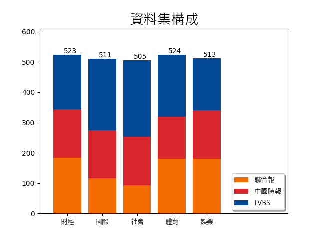

## Demo
網址：http://lyon.csie.io/classify
## 檔案說明
- crawler 寫很久的爬蟲們
    - record.py 操作資料庫的共用函數
    - chromedriver.exe 驅動器(需自備)
    - chinatimes.py 中時爬蟲
    - tvbs.py TVBS爬蟲
    - udn 聯合報爬蟲
    - udn_star 聯合報娛樂版爬蟲
- models 訓練完的模型
- plots 圖表
    - dataset.png 資料集組成圖
- articles.db 珍貴的資料集 SQLite格式
- BertClassifier.py 分類器模型物件定義
- Dataset.py 預處理資料集物件定義
- train.py 訓練分類器模型
- train.log 訓練過程的log
- demo.py 展示分類成果
- bertTest.py bert實驗
- evaluate_types.py 測量單個模型在各類別的精準度
- evaluate.py 測量各模型的精準度
- split.py 分割訓練、測試資料集
- statistic.py 統計資料集組成，並顯示圖表
- readme.md 說明檔案
### 資料集
來自三家新聞網站，取五種不同的新聞分類，每種分類約500則新聞資料。

### 模型
模型可視情況使用train.py訓練
- head_4 使用首段訓練，可辨別4分類
- title_4 使用標題訓練，可辨別4分類 
- head_5 使用首段訓練，可辨別4分類
- title_5 使用標題訓練，可辨別4分類 